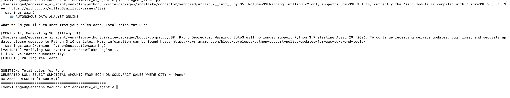
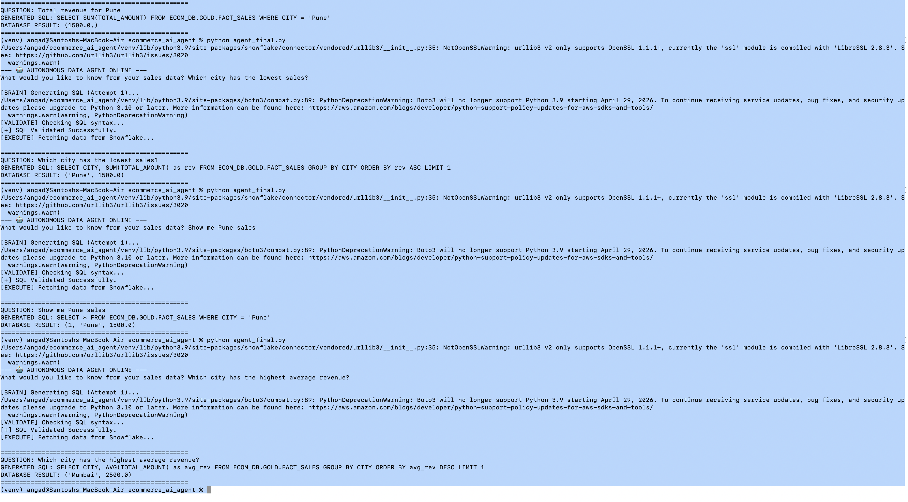

## 🚀 How to Run
To run this agent locally, follow these steps:

1. Prerequisites
Python 3.9+

A Snowflake account (Trial or Enterprise)

A dataset in Snowflake (Table: ECOM_DB.GOLD.FACT_SALES)

2. Installation
Clone the repository and install the dependencies:

Bash
git clone https://github.com/santoshpawar642/ecommerce-ai-agent.git
cd ecommerce-ai-agent
python -m venv venv
source venv/bin/activate  # On Windows: venv\Scripts\activate
pip install -r requirements.txt
3. Setup Snowflake Permissions
Log into your Snowflake Worksheet and ensure your user has access to Cortex AI:

SQL
GRANT DATABASE ROLE SNOWFLAKE.CORTEX_USER TO ROLE ACCOUNTADMIN;
4. Configuration
Open agent_final.py and update the SNOWFLAKE_CONFIG dictionary with your credentials:

Python
SNOWFLAKE_CONFIG = {
    "user": "YOUR_USERNAME",
    "password": "YOUR_PASSWORD",
    "account": "YOUR_ACCOUNT_ID",
    "warehouse": "COMPUTE_WH",
    "database": "ECOM_DB",
    "schema": "GOLD"
}
5. Launch the Agent
Run the script and ask a question in plain English:

Bash
python agent_final.py
Example Question: "What was the total revenue in Pune last month?"

## 📊 Live Demo (Proof of Concept)

### 🧠 Advanced AI Logic
The agent now uses **Few-Shot Prompting** and **Llama 3.1 70B** to handle complex analytical queries:
* **Aggregation Support:** Correctively identifies `AVG`, `SUM`, and `COUNT`.
* **Analytical Ranking:** Handles `GROUP BY`, `ORDER BY`, and `LIMIT` logic automatically.
* **Self-Correction:** Automatically retries up to 3 times if Snowflake returns a syntax error.

#### **Logic Test Result:**

